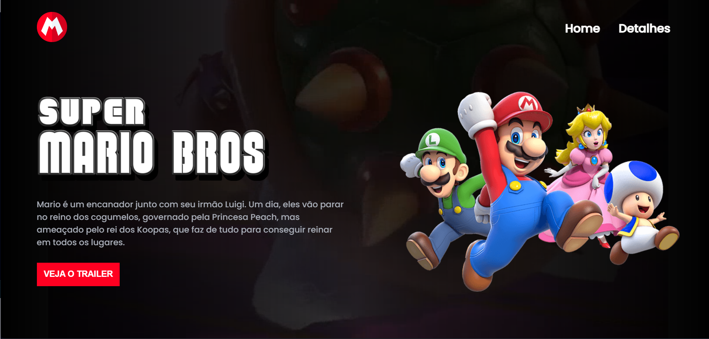

# Site Mario O Filme 

Este é um site dedicado ao Filme do mario,  Aqui você encontrará informações detalhadas sobre o filme.

## Descrição

Site do Mario O Filme: é uma landing page projetada para fornecer  informações detalhadas sobre o filme, mostrando o trailer.

## Como Usar

1. Acesse o site Super Mario
2. Navegue pela site e clique nas informações disponíveis.
3. assita o trailer, descubra mais sobre o filme!

## Tecnologias Utilizadas

- HTML5
- CSS3
- JavaScript

## Contribuição

Contribuições são bem-vindas! Se você quiser contribuir para este projeto, siga estas etapas:

1. Fork o projeto.
2. Crie uma nova branch (`git checkout -b feature/nova-funcionalidade`).
3. Faça commit das suas alterações (`git commit -am 'Adicione uma nova funcionalidade'`).
4. Faça push para a branch (`git push origin feature/nova-funcionalidade`).
5. Abra um Pull Request.

## Visualização

Aqui está uma prévia de como o site aparece(Clique na imagem caso queira acessar o site)

## Contato

- E-mail: guisilvam19@gmail.com ou  guilhermemachado019@gmail.com
- Projeto Link: https://guilherme-silvam.github.io/site-mario-o-filme/